# @bylive/nestjs



### 示例一

```typescript
import { Module, Injectable } from '@bylive/ioc';
import { Controller, GET, Query } from '@bylive/router';
import { KoaNestTs, Logger } from '@bylive/nestjs';

// 服务
@Injectable()
export class UserServer {
  find(optoin: Record<string, any> = {}) {
    return { name: 'user1' };
  }
}

// 控制器
@Controller('user')
export class UserController {
  constructor(private userServer: UserServer) {}
  @GET()
  list(@Query() query: any) {
    return this.userServer.find();
  }
}

// 模块
@Module({
  imports: [],
  controllers: [UserController],
  providers: [UserServer],
})
export class appModule {}

function start() {
  const app = KoaNestTs.create(appModule, { prefix: '/api' });
  app.listen(8080, () => {
    Logger.info('app is runing in prot 8080');
  });
}
start();
```
